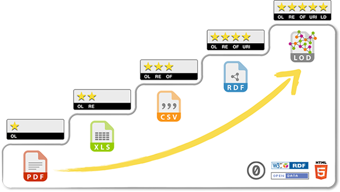
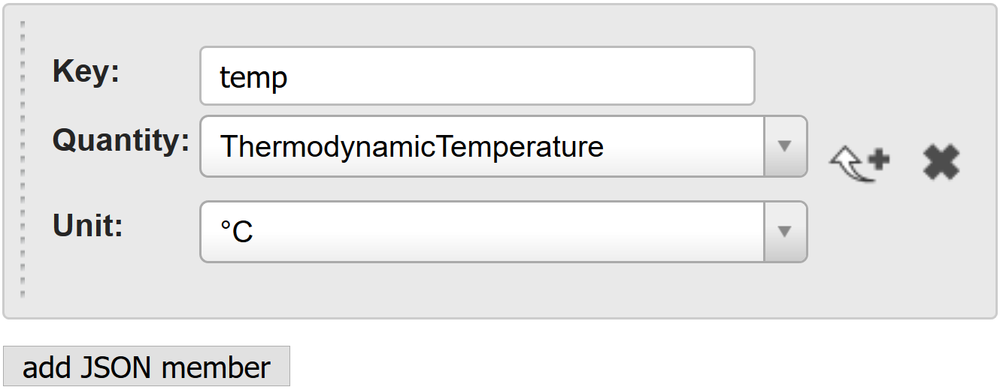
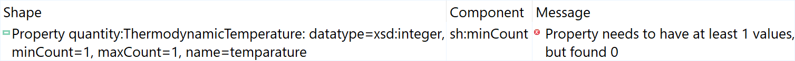

# Semantic

!!! note "Responsible person for this section"
    Matthias Frank

Due to the heterogeneity of [data sources](../../data-sources) within BigGIS, an explicit semantic is required that provides
meaningful descriptions of formats, syntax and semantics of each source. For that purpose, we have developed a 
[semantic data management](#semantic-data-management) platform that enables five star meta data including shared vocabularies
and background knowledge from concept that are available as Linked Open Data. Using the knowledge base retrieved from
the semantic data management platform, we allow users of the platform to add additional meta data to JSON messages
of environmental observations. Bases on these annotations, we provide [semantic message enrichment](#semantic-message-enrichment)
on-the-fly and add explicit semantics to the key-value pairs of the observation, including provenance, measured quantities,
units and data types. The semantically enriched messages are the basis for further evaluation and transformation.
One example for further processing of a semantically enriched data stream is [shape constraint validation](#semantic-data-validation),
which we demonstrate in the last subsection.

## Semantic Data Management

The first step towards unified and meaningful descriptions of observations is the semantic data management platform.
We aim to have these descriptions in an open, machine processable and interlinked format, or in short, as five star data:

> **Figure:**
> From Open Data to Five Star Data

For that purpose we introduce Linked Data Wiki (LD-Wiki), a MediaWiki bases knowledge management platform. The core of
LD-Wiki is the Linked Data Management Module (LDaMM) for updating, querying, reasoning, linking and rule execution
on semantic statements in both, LOD and local storage. The architecture of LD-Wiki is as follows:

> **Figure:**
> Architecture of Linked Data Wiki

LD-Wiki enables easy reuse of properties of well-known entities and context knowledge from LOD. As an example,
the common knowledge of the concept of a city is already described in LOD sources like schema.org, WikiData or DBPedia.
To find instances of this concept in LOD, we link the category in LD-Wiki to the according LOD concepts:

> **Figure:**
> Linking concepts from LOD to LD-Wiki

When creating new instances of this category withing LD-Wiki, existing instances of the related concepts in LOD with 
a similar label can be employed and the values of their properties can be reused in the context of LD-Wiki:

> **Figure:**
> Linking entities from LOD to LD-Wiki

## Semantic Message Enrichment

The second step towards unified and meaningful descriptions of observations is the annotation of observation messages.
With these annotations, we add explicit semantics to the key-value pairs of a JSON message:

> **Figure:**
> Explicit Semantics for JSON messages

In the backend, the annotations are linked to shared concepts for unified and meaningful interpretation of observations
from heterogeneous sensors. Based on these annotations, an uplifting of non-semantic data streams from heterogeneous
observation stations with explicit semantics can be performed on-the-fly:

> **Figure:**
> Semantic uplifting of JSON messages to JSON-LD based on meta data

The semantic enrichment process creates a new message with a list of values. Each $value$ of the new message is assigned
for each member $n$ of a message with the according explicit semantic of meta data $m$ as

$$
    \sum_{n=0}^N \sum_{m=0}^M value_{n,m} := 
    \begin{cases}
        member_{n,val} \circ meta_{m,val}		& \text{if } member_{n,key} = meta_{m,key}\\
        \emptyset																& \text{otherwise}
    \end{cases}
$$

with $member$ being the set of $N$ members of a concrete message without any meta data and $meta$ being the set of meta
data for a class of messages with explicit semantic of $M$ known types of observations. Each element of both sets
consists of $key$ and $value$. If $key_{n}$ of a member element is equal to $key_{m}$ of a meta data element,
$value_{n}$ of member element is combined with $value_{m}$ of the meta data element using the binary operator $\circ$
in order to add explicit semantics to the original observation. The functionality of the binary operator $\circ$ is defined as

$$
    f(member, meta) = 
    \begin{cases}
        data(member, meta)													& \quad  \text{if } member \in \left\{string\right\} \\
            data(member, meta)													& \quad  \text{if } member \in \left\{number\right\} \\
            data(member, meta)													& \quad  \text{if } member \in \left\{bool\right\} \\
            object(member, meta)												& \quad  \text{if } member \in \left\{object\right\} \\
            \sum_{n=0}^N member_{n} \circ meta_{n}			& \quad  \text{if } member \in \left\{array\right\} \\
        \emptyset																		& \quad  \text{if } member \in \left\{null\right\}
    \end{cases}
$$

The function $data(member, meta)$ adds the data type property of $meta$ to the new message and includes the literal
value of $member$ in conjunction with the XSD data type associated with $meta$. The function $object(member, meta)$
adds the object property of $meta$ to the new message and includes an URI reference to the object in $member$.
As the value of an array is nothing else but a list of $N$ values, we can simply execute the function $f(member, meta)$
on each element $n$ of that list. However, as we identify the meta data for each member by its key, there can only be
a single data type property or object property which is applied to all elements of an array. Different types of values
within a single array are not supported.

As an example, we use the JSON messages of [LUBW stations](../../data-sources/atmosphere/lubw) and push them to a 
message broker:

    {
        "no2":61,
        "ozn":10,
        "luqx":0,
        "latitude":48.18169,
        "heigth":510,
        "so2":0,
        "station":"DEBY189",
        "pm10":0,
        "timestamp":1516191751218,
        "longitude":11.46445
    }
> **Listing:**
> Example of a LUBW observation as JSON

> **Figure:**
> Example for LUBW data stream

Another example are the JSON messages of [senseBox-based weather stations](../../data-sources/atmosphere/sensebox-fzi),
which are pushed to another topic of the message broker:

    {
        "title": "Temperatur",
        "unit": "°C",
        "sensorType": "HDC1008",
        "icon": "osem-thermometer",
        "_id": "59ec966d49f6f80011c1239a",
        "lastMeasurement": {
            "value": "7.98",
            "createdAt": "2018-01-18T13:02:14.330Z"
        }
    }
> **Listing:**
> Example of a senseBox observation as JSON

> **Figure:**
> Example for senseBox data stream

By employing the explicit meta data, we gain a new message stream of JSON-LD messages with explicit semantic of
each observation:

> **Figure:**
> Example for semantically enriched data stream

## Semantic Data Validation

Once we have a data stream of observation messages from heterogeneous data sources but with explicit semantics,
we can also perform a semantic validation for all messages. For these validations, we again employ our annotation
platform to define data shapes (patterns) that should be fulfilled by all observation messages, regardless from which observation
station they are retrieved:

> **Figure:**
> Shape constraint annotation

Applying these shapes on the JSON-LD observation messages tells us immediately whether the observation is conform
to the defined shape or not:

> **Figure:**
> Shape constraint validation of JSON-LD messages