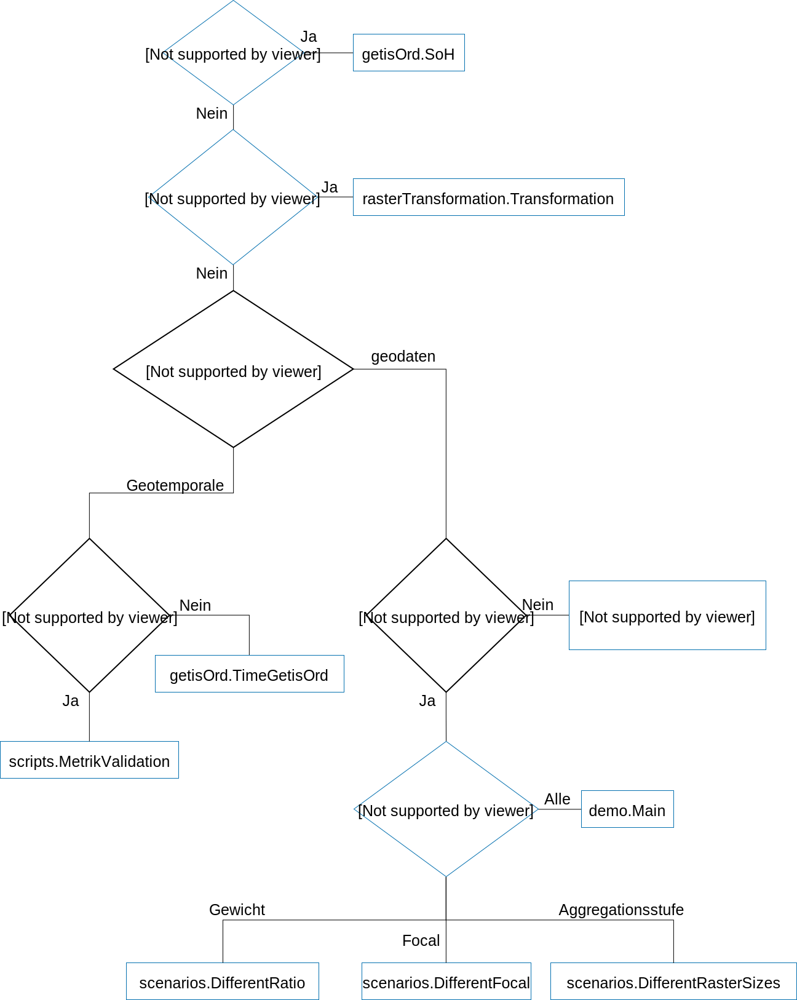

# Stability of Hotspots

       Related repository is https://github.com/biggis-project/soh-stability-scala

Für die Berechnung der Hotspots kann G*und Focal G*verwendet werden.
Es kann die größe der Focalmatrix und der Gewichtsmatrix variiert werden, sowie die Aggregationsstufe.
Spezifischere Einstellungen können über die Klasse Parameter.Settings vorgenommen werden.
Für geotemporale Daten kann zusätzlich noch eine Zoomsutfe angegeben werden.
Für mehr Details siehe Masterarbeit von Marc Gassenschmidt.
Über den Flowchart kann ermittelt werden, welche Klasse genutzt werden kann.

## Metriken die Evaluiert werden
Basierend auf berechneten Cluster:

- SoH
- Nachbarschaft 6 * SoH(Focalmatrix +1 -1, Gewichtsmatrix +1 -1, Aggregationsstufe +1 -1)
- Referenzbild ohne Zeitliche Dimension
- Referenzbild mit Parametrisierung GisCup
- Moran's I
- Jaccard Index
- F1-Score

Direkt auf den Ergebnissen der Statistik:

- Kullback Leibler Divergenz
