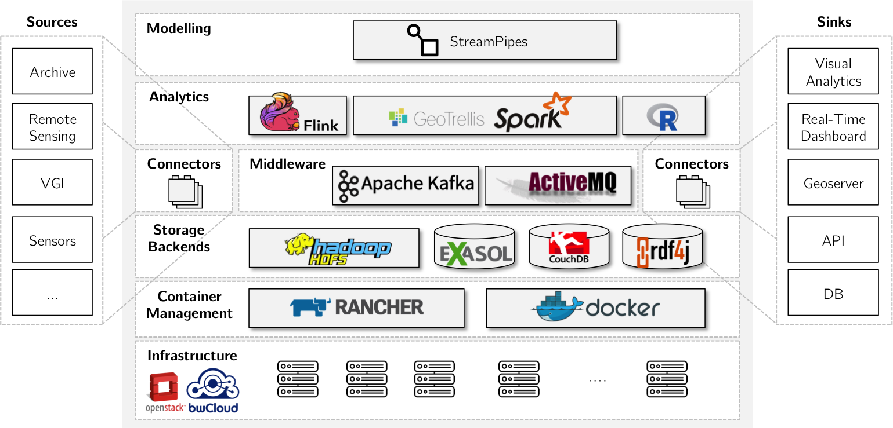

# Overview

!!! note
    Related repository is https://github.com/biggis-project/biggis-infrastructure

The BigGIS architecture, as depicted in the picture above, consists of several layers that are 
briefly discussed in the following.

## Modelling

Pipelines in BigGIS are modelled leveraging [StreamPipes](../StreamPipes). StreamPipes allows to 
transform and analyse sensor landscape and other data streams with less programming effort. We 
extend StreamPipes to support geo-spatial data analytics, e.g. raster data.

## Analytics

To process and analyze the geo-spatial data, BigGIS relies on multiple big data analytics 
frameworks. While [Apache Flink](https://flink.apache.org/) is mainly used for sensor data,
some application use cases need to process geo-spatial raster or vector data in batches as well. 
Thus, we integrate [Apache Spark](https://spark.apache.org/) featuring [GeoTrellis](https://geotrellis.io/) into our architectural design in order to process geographic data. GeoTrellis provides a 
number of operations to manipulate raster data including map algebra operations. In addition, we 
provide other data science notebooks (RStudio, Jupyter) to exploratively analyze the data.

## Middleware & Connectors

[Apache Kafka](https://kafka.apache.org/) is used as the primary message broker. It handles the 
communication between the data processing elements, i.e. nodes, within the analytics pipelines. 
Besides, [ActiveMQ](http://activemq.apache.org/) is another message broker which can be used in 
addition to Kafka. Currently, the main purpose is to provide an endpoint for the websocket 
connections required by the real-time dashboard of the StreamPipes UI.

## Storage Backends

Internally, BigGIS uses a variety of different storage backends for designated purposes.

  - [HDFS](http://hadoop.apache.org/) for GeoTrellis catalog and Spark jobs.
  - [Exasol](https://www.exasol.com/de/) for fast access of stored data.
  - [CouchDB](http://couchdb.apache.org/) for pipelines, users and visualizations created in the dashboard.
  - [RDF4J](http://rdf4j.org/) (formerly Sesame) as a semantic backend of StreamPipes.

## Container Management

Running these containers in a distributed manner requires a wide variety of technologies, that 
must be integrated and
managed throughout their lifecycle. To easily deploy our containers, our infrastructure is 
designed to run on
[Rancher](http://rancher.com/) as our container management platform. Rancher enables 
organizations to run and manage Docker and Kubernetes in production, providing four major 
components, that are:

  1. Infrastructure Orchestration
  2. Container Orchestration and Scheduling
  3. Application Catalog
  4. Authentication

That way, it is fairly easy to set up a distributed Rancher cluster in a couple of minutes (see 
the official [documentation](http://rancher.com/docs/rancher/v1.6/en/) for more information).

## Infrastructure

BigGIS infrastructure leverages [bwCloud](https://www.bw-cloud.org/) Infrastructure-as-a-Service 
(IaaS) offer powered by Openstack. See the section [bwCloud](../platform-bwcloud) for 
additional information about the infrastructure setup.

