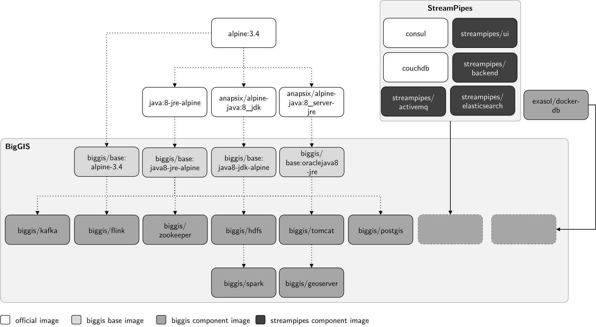

# Components

BigGIS is composed of several dockerized building blocks that are mostly all available on [Dockerhub](https://hub.docker.com/u/biggis/). Some components, that are still under development may not be available on the public 
Dockerhub and are stored on our private internal Docker registry. This section will not explain the basics behind 
Docker. For more information, we refer to the official [Docker documentation](https://docs.docker.com/). 

## Dockerized Base Images
To minimize the overall image sizes and thus speed up the deployment of our infrastructure stack, the dockerized 
application rely on tiny Linux [Alpine](https://alpinelinux.org/) images that are roughly a couple of megabytes in 
size. On top of that, we build our own BigGIS base images, that provide a minimal set of overall oftentimes used 
packages and functionalities as a general starting point to dockerize our components. An excerpt of the Dockerfile for 
our `biggis/base:alpine-3.4` image is shown in the following.

```Docker
FROM alpine:3.4

MAINTAINER wipatrick

...

ADD repositories /etc/apk/
RUN apk add --no-cache gosu@testing tzdata && \
    mkdir /storage /opt

COPY entrypoint.sh /usr/local/bin/entrypoint.sh

WORKDIR /home

ENTRYPOINT ["/usr/local/bin/entrypoint.sh"]
```
Of interest is the specified entrypoint script, that allows to start the application process as a non-root user, 
which is key to provide an additional level of security. If not specified by the application developer, the container
 process is started with a default uid (9001) and user (biggis).

```bash
#!/bin/sh

# Add local user
# Either use the USER_ID if passed in at runtime or
# fallback

USER_ID=${USER_ID:-9001}
USER=${USER_NAME:-biggis}

# Set the timezone. Base image does not contain the setup-timezone script, so an alternate way is used.
if [ -n "$TIMEZONE" ]; then
    cp /usr/share/zoneinfo/${TIMEZONE} /etc/localtime && \
	echo "${TIMEZONE}" >  /etc/timezone && \
	echo "Container timezone set to: $TIMEZONE"
else
	echo "Container timezone not modified"
fi

echo "Starting with UID : $USER_ID"
addgroup -S -g $USER_ID $USER
adduser -h /home/$USER -u $USER_ID -s /bin/sh -G $USER -S $USER
chown -R $USER:$USER /home/$USER /opt /tmp /storage
export HOME=/home/$USER

exec gosu $USER "$@"
```

In general, we provide four types of base images:

| # | Docker Image                 | Compressed Size |
|---|------------------------------|----------------:|
| 1 | biggis/base:3.4-alpine       |            3 MB |
| 2 | biggis/base:java8-jre-alpine |           44 MB |
| 3 | biggis/base:java8-jdk-alpine |           67 MB |
| 4 | biggis/base:oraclejava8-jre  |           49 MB |

## Dockerized Frameworks and Applications

As shown in the [architectural overview](../arch-overview), BigGIS is composed of several Big Data frameworks as 
well as other use case specific components (e.g. for demo visualizations) that are deployed and run as stacks of Docker 
containers on our bwCloud infrastructure. A quick overview of the dockerized frameworks and applications is depicted in 
the following figure.

!!! info "Figure: Hierarchical composition of our Docker images."
    
    
As mentioned above, we leverage the capability to share base images between multiple child images through the layered
 image structure of Docker. Almost all of our dockerized frameworks and applications are based on official Dockerhub 
 images that are minimally extended to serve our purposes. Other than that we integrate other third-party Docker 
 images from the [Streampipes](../stream-pipes) or the Exasol database project into our container ecosystem.