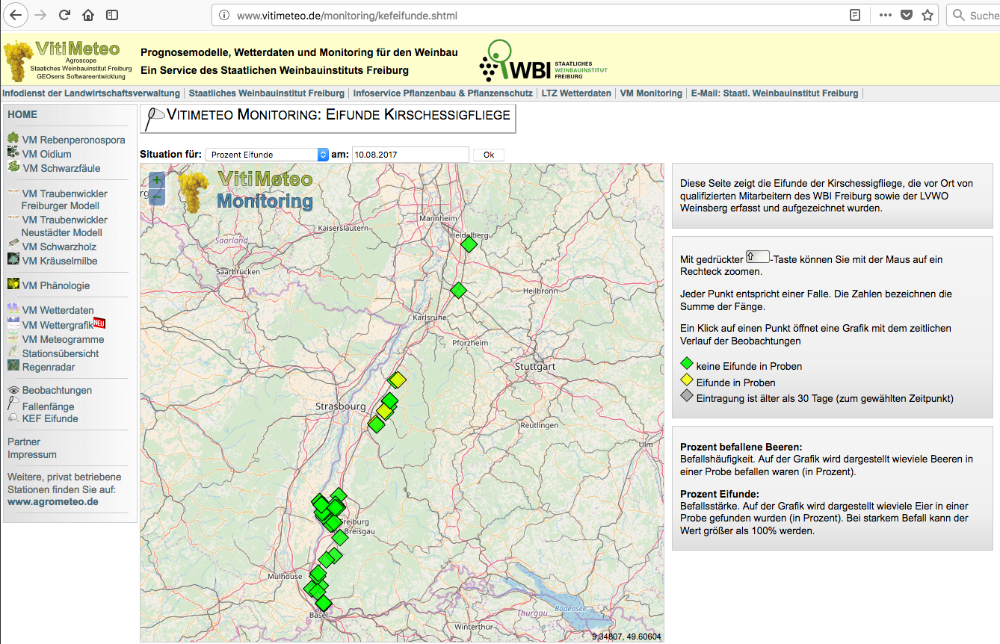

# Drosophila Suzukii Observations (Vitimeteo)

!!! note "Responsible person for this section"
    - Johannes Kutterer (Disy)

[VitiMeteo]: http://www.vitimeteo.de

The website [VitiMeteo] provides informations for winemakers. The site is provided by the Staatliches  Freiburg.  

!!! info "Figure 1: Screenshot of [VitiMeteo] webpage: Showing reported egg finds"
    

In the data provided by VitiMeteo are, among other things, observations of the spread of D. suzukii. This data consists of trap findings of D. suzukii as well as percentage information about how many berries were infested in a sample taken at the station. Additionally, there is percentage information about how many eggs were found in a sample. This percentage can be over 100%, if there are more egg findings than berries in a sample. These observations are collected from 867 stations non-uniformly spread over Baden-Wuerttemberg.

see also [invasive-species](../../../demos/invasive-species)
