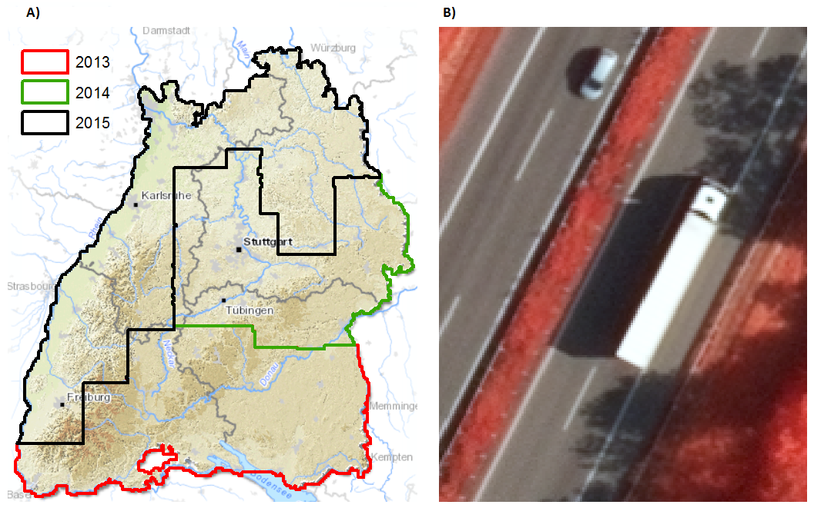

# Digital ortho-images (Arial photographs)

Digital ortho-images were aquired across different flight campaigns between 2013 and 2015 building a mosaic that covers
Baden-Württemberg entirely (see **Figure 1 A**). The georeferenced images come with 4 spectral bands (blue,
green, red, infra-red) and a spatial resolution of 20cm (see **Figure 1 B**). The non-public dataset was provided by the State Institute for Environment of Baden-Württemberg
(LUBW) and State Agency for Spatial Information and Rural Development Baden-Württemberg (LGL).

!!! note ""
**Figure 1:** A) Overview on image aquisition years B) False color composite (R= infra-red, G=green, B=blue) of digital ortho-images with 20cm spatial resolution.
    
