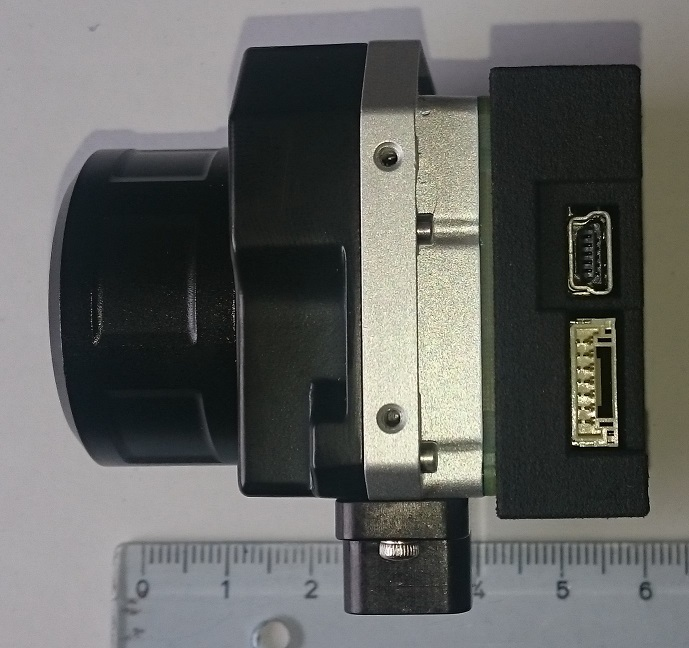
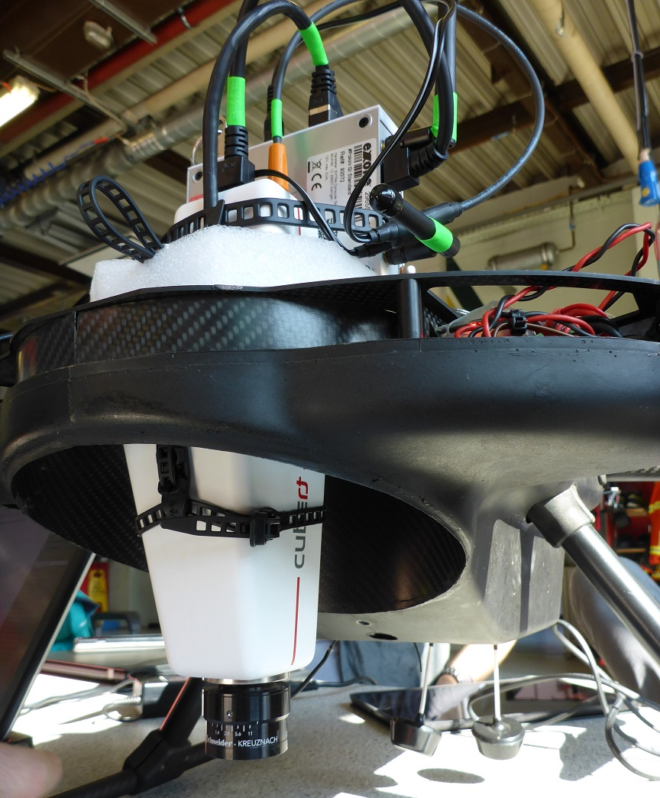

# Lightweight Camera Systems

!!! info "Figure 1: Sony QX1 mounted on UAV Dual Camera Gimbal together with FLIR"
    

## RGB camera information

!!! todo
    Bodo

As RGB camera systems the SONY Alpha series was used in the
BigGIS-Project. These consumer market cameras are used due to the fact
that the optical specification fits to the need of the project and that
they are wildly used to be mounted to a UAV/UAS. After using a Sony
Alpha 1 camera in the first flying campaign the project switched to the
Sony QX1 ILCE (Alpha series) because of several reasons which are tested
in the second campaign:

  - No camera body (reduction of camera weight)
  - WiFi connection (no straps / cables which can influence the gimbal position)
  - Exchangeable objectives (lenses) for a perfect fit to the focal length of the IR camera

Specifications and relation to the flight height over ground:

| **SONY ILCE QX 1**     |      |      |                                  |       |   |      |      |      |       |
|------------------------|------|------|----------------------------------|-------|---|------|------|------|-------|
|                        |      |      |                                  |       |   |      |      |      |       |
| **Sensor format**      | 23,2 | 15,4 | [mm²] according to manufacturer  |       |   |      |      |      |       |
|                        | 5456 | 3632 | pixel  according to manufacturer |       |   |      |      |      |       |
|                        | 4,25 | 4,24 | size of pixels in µm             |       |   |      |      |      |       |
|                        |      |      |                                  |       |   |      |      |      |       |
| **focal length (mm)**  | 28,0 | 28,0 | 28,0                             | 28,0  |   | 19,0 | 19,0 | 19,0 | 19,0  |
| pixel size (μm)        | 4,3  | 4,3  | 4,3                              | 4,3   |   | 4,3  | 4,3  | 4,3  | 4,3   |
| cruising altitude (m)  | 25,0 | 50,0 | 75,0                             | 100,0 |   | 25,0 | 50,0 | 75,0 | 100,0 |
| ground resolution (cm) | 0,4  | 0,8  | 1,1                              | 1,5   |   | 0,6  | 1,1  | 1,7  | 2,2   |
| ground coverage X (m)  | 20,7 | 41,4 | 62,1                             | 82,8  |   | 30,5 | 61,0 | 91,5 | 122,0 |
| ground Coverage  Y (m) | 13,8 | 27,6 | 41,3                             | 55,1  |   | 20,3 | 40,6 | 60,9 | 81,2  |

To program the Sony QX1 one can use Sony Capture API, which is an C++
implementation with the following features:

  - Based on SONY DSC-QX10
  - LINUX / Python Wrapper
  - SSDP Client to establish the WiFi connection
  - HTTP commands
  - JSON format

Further information:
<https://www.sony.de/electronics/wechselobjektivkameras/ilce-qx1-body-kit>

!!! info "Figure 2: Sony QX1 mounted on UAV Dual Camera Gimbal together with FLIR"
    

## Thermal IR camera information

!!! todo
    Bodo

Like with the RGB camera the project used two types of IR cameras which
could easily be mounted on a UAV. In the first flying campaign we
performed a test using the OPTRIS PI LightWeight camera which is a very
small thermal image camera with appropriate specifications:

  - Operation system: Linux
  - Full radiometric IR inspection
  - Radiometric data saved on a CuBOX industry computer during the flight
  - Optical resolution 640 x 480 pixel
  - Weight (camera + companion PC): 325 g
  - Size 46 x 56 x 90 mm
  - Spectral range 7,5 to 13 µm

The possibility to safe real radiometric data was of special interest
for the later on analysis. During the work it got clear, that the real
specification (calibration etc.) for the thermal calculation could only
be accessed by using the original OPTRIS software. It was encrypted and
the data was stored in an additional line in the thermal images. OPTRIS
gave no access to that line which make it difficult to transfer the data
to an image processing software.

Therefore, the second campaign was performed by using a FLIR Vue Pro R,
were the “R” stands for “radiometric”. The Vue Pro also was designed for
UAV applications. Two facts speaks for the Vue Pro: 1.) There is a full
access to the raw radiometric data and 2.) there are a choice of three
different lenses (9 mm, 13 mm, 19 mm).

  - Operation system: Linux
  - Full radiometric IR inspection
  - Radiometric data saved as raw data on any companion PC during the flight
  - Optical resolution 640 x 512 pixel
  - Weight (only camera): 92,1 – 113,4 g depending on configuration
  - Size 44,4 x 57,4 x 67 mm
  - Spectral range 7,5 to 13,5 µm

The FLIR Vue pro R was used together with the so called TeAx Thermal
Capture device which stores the radiometric raw data on a storage device
like a USB stick, a memory chip or a companion PC. Within the project
the camera was combined with a ODROID PC. The features of the
ThermalCapture device:

  - Store Digital RAW data on a storage device
  - No transmission errors in images
  - Provides position and time (GPS) based on UAV downlink
  - Weigh 45 g including housing
  - Easy post-production due to free ThermalCapture software

RAW Data is transformed into images during post-processing with the help
of included software ThermoViewer. The needed parameters for conversion
can be detected automatically. Those parameters can be changed
afterwards manually by the user, to receive the result for every case.

Of special interest is the possibility to choose from three different
focal lengths / lenses. So it could be fitted to the focal length of the
SONY QX1 which ensure a nearly similar ground coverage:

| **FLIR Vue Pro R**     |      |      |                                  |       |   |      |      |      |       |
|------------------------|------|------|----------------------------------|-------|---|------|------|------|-------|
|                        |      |      |                                  |       |   |      |      |      |       |
| **Sensor format**      | 10,9 | 8,70 | [mm²] according to manufacturer  |       |   |      |      |      |       |
|                        | 640  | 512  | pixel  according to manufacturer |       |   |      |      |      |       |
|                        | 17   | 17   | size of pixels in µm             |       |   |      |      |      |       |
|                        |      |      |                                  |       |   |      |      |      |       |
| **focal length (mm)**  | 13,0 | 13,0 | 13,0                             | 13,0  |   | 9,0  | 9,0  | 9,0  | 9,0   |
| pixel size (μm)        | 17,0 | 17,0 | 17,0                             | 17,0  |   | 17,0 | 17,0 | 17,0 | 17,0  |
| cruising altitude (m)  | 25,0 | 50,0 | 75,0                             | 100,0 |   | 25,0 | 50,0 | 75,0 | 100,0 |
| ground resolution (cm) | 3,3  | 6,5  | 9,8                              | 13,1  |   | 4,7  | 9,4  | 14,2 | 18,9  |
| ground coverage X (m)  | 20,9 | 41,8 | 62,8                             | 83,7  |   | 30,2 | 60,4 | 90,7 | 120,9 |
| ground coverage  Y (m) | 16,7 | 33,5 | 50,2                             | 67,0  |   | 24,2 | 48,4 | 72,5 | 96,7  |

Within the project the lens with the 13 mm focal length was chosen for
it has nearly the same ground coverage them the 28 mm lens of the SONY
QX1.

Further information:

Optris PI LightWeight: <https://www.optris.de/pi-lightweight-netbox>

FLIR Vue Pro R: <http://www.flir.de/suas/content/?id=70728>

TaAx Technology ThermalCapture Grabber:
<http://thermalcapture.com/thermalcapture-grabber-usb/>

!!! info "Figure 3: FLIR Vue Pro R with TEAX Thermal Capture Grabber USB"
    
    
    

## Hyperspectral camera information

!!! todo
    Alex

The reason to choose the Cubert UHD 186 Firefly as a specific
hyperspectral camera depends on the scenario. It was aimed to detect
“chemicals” in a smoke cloud during a fire event. This proof of concept
should give a realistic scenario with a CBRN incident: A fire produces
smoke and with help of the convective process a chemical is distributed
into the environment.

Due to the fact that it was not allowed to choose toxic / dangerous
chemicals it was decided to use a fire training smoke
(1,2-Propylenglycol) for a standard smoke machine. The training smoke
was contaminated with at least 40 % of chlorophyll from the food industry
which usually is uses as food colorant and a not toxic substance.

Therefore, an appropriate hyperspectral camera had to be able to find
chlorophyll in the smoke to what the Firefly is able.

Specifications:

  - wavelength range: 450nm – 950nm 125 channels
  - resolution: 8 nm @ 532 nm sampling 4 nm
  - pan resolution: 1 Megapixel 2500 spectra / cube
  - elongated version, weight 490g
  - power consumption 8W @ 12V

To mount the camera to an UAV ist was necessary to build a special
gimbal. In both flight campaign only vertical photographs was
collected.

Further information:

Today’s model: S 185 Hyperspectral SE FireflEYE:
<http://cubert-gmbh.com/uhd-185-firefly/>

!!! info "Figure 4: Hyperspectral Cubert UHD 186 Firefly"
    
    
