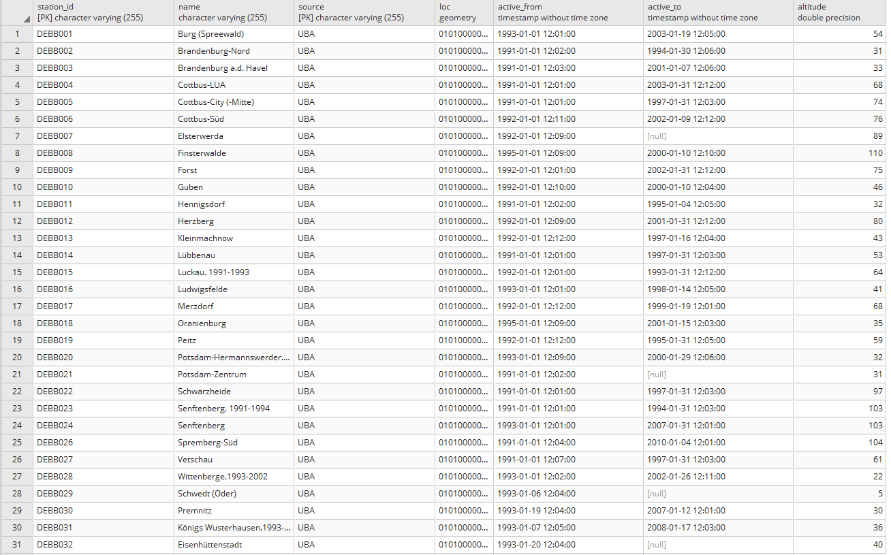

# Umweltbundesamt Air Pollution

The Umweltbundesamt (UBA) provides data about the concentration of fine dust and other pollutants (CO/SO2/NO2 etc). General documentation from the UBA can be found [here](https://www.umweltbundesamt.de/daten/luftbelastung/aktuelle-luftdaten#/start?s=q64FAA==&_k=htnl59). For Germany, around 320 stations are installed. PM10 fine dust concentrations are available as daily averages, CO as 8-hour averages, all others as 1-hour averages. As the gathered data is directly available as CSV using formatted URLs, we saved all available data in our database. Furthermore, every new added measurements are automatically added to our database. 

Picture 1: Subset of one of our metadata tables to store the UBA air pollution data. 
