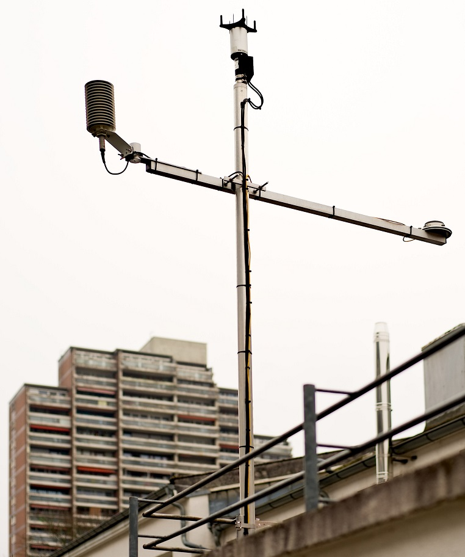

# LUBW Stations

    
## Air Measurements

The LUBW mangages 50-80 aktive measurement stations across Baden-Württemberg, which provide hourly information on three
main air pollutants (see **Figure 1**):

  - Nitrogen oxides
  - Ozone 
  - Particular matter (Feinstaub)

The data is public and can be downloaded from the official web-page:
https://www.lubw.baden-wuerttemberg.de/luft/messwerte-immissionswerte#karte

!!! note ""
    **Figure 1:** Webpage LUBW with distribution of air measurement stations.
    

## LUBW REST API

Air measurment data collected by the LUBW (Nirtogen oxides, Ozone, Particular Matter) is also provided by a REST-Service
for the BigGIS project. The service is not public and delivers the current measurement value of each measurement
station and each pollutant in json format. The service also allows to aquire data on air pollutant from Bavaria,
Thuringia, Saxony-Anhalt and Schleswig-holstein.

Here the data source is the Federal Environmental Agency:
https://www.umweltbundesamt.de/daten/luftbelastung/aktuelle-luftdaten#/start?s=q64FAA==&_k=ep8c63

## Meteorological Station at FZI

In January 2017 a meteorological station was mounted at the roof of FZI for measuring air pressure, temperature, wind
speed, precipitation, humidity and global radiation  (see **Figure 2**). The measurements serve for calibrating and validating the sense
boxes. The measurement device will be dismounted in April 2018.

!!! note ""
**Figure 2:** Weather station at the FZI 

