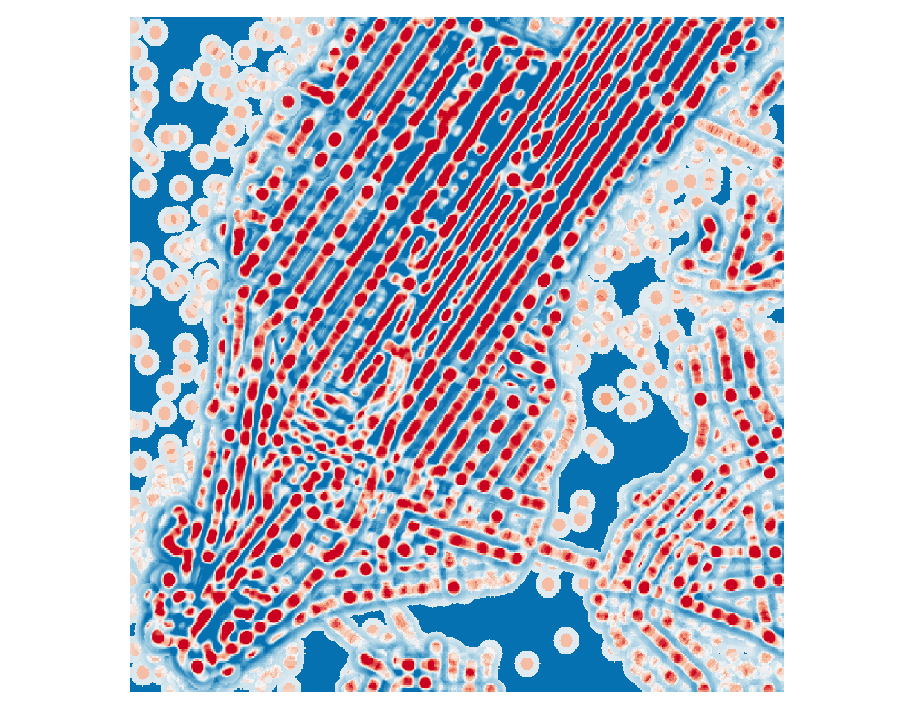
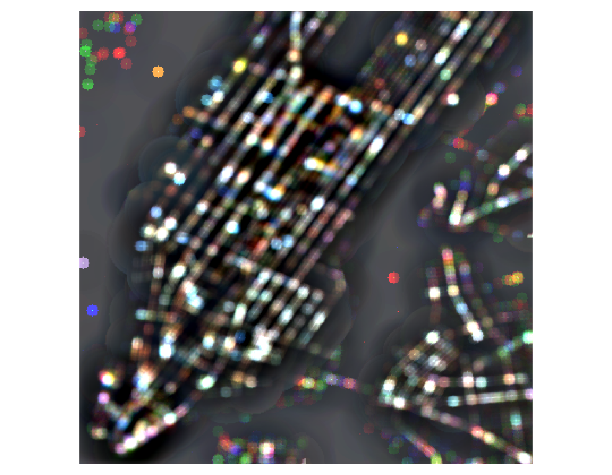

# Stability of Hotspots

## Setup

In parameters.Setting müssen zuerst die Ordner spezifiziert werden.
inputDirectoryCSV: Ordner für die CSV Daten. Falls Daten nicht vorhanden ändern auf lokalen Ordner.
Zum Download der Daten in demo.Main bis Zeile 16 das Programm Ausführen. 
Dadurch werden die New York Taxi Trip Data für Januar/Februar/März 2011-2016 automatisch heruntergeladen.
Vorsicht ca. 30 GB.
`ouptDirectory` und `statDirectory` sind die Pfade an denen die Ergebnisse gespeichert werden.

## Berechnung von Hotspots für geo Daten

Für die Berechnung der Hotspots und Variation der Focalmatrix/Gewichtsmatrix und Aggregationsstufe kann demo.Main ausgeführt werden.

Scenario(Variation der Parameter zwischen Parent und Child): Focal/Weight/Aggregationsstufe

Ergebnisse sind zu finden unter "outputDirectory"/"Scenaria"/focal_/"(true|false)"d3.csv
Z.B. "outputDirectory"/Aggregation/focal_falsed3.csv
`F,W,Z,Down,Up
0,1,2,0.0,0.06053811659192825
0,1,3,0.0,0.10396039603960396
...`

Sowie die Tifs in Ordner `2016`.
Lässt sich dann Folgendermaßen mit QGis darstellen:

## Berechnung von Hotspots für geotemporale Daten

scripts.MetrikValidation kann ausgeführt werden um die Berechnung für den geotemporalen Raum durchzuführen. Hierbei werden für die Metriken `getisOrd.SoH#getMetrikResults` aufgerufen.
Unter scripts.MetrikValidation#getScenarioSettings kann ein Array mit verschiedene Versuchseinstellungen angelegt werden.
Dafür wird dann:

- G* für 2016 berechnet
- Metriken berechnet
- G* für 2011-2015 und die Prozentuale Übereinstimmung

- Focal G* für 2016 berechnet
- Metriken berechnet
- Focal G* für 2011-2015 und die Prozentuale Übereinstimmung

Der Pfad der Ergebnisse der Metriken sind in der Methode `importExport.PathFormatter#getResultDirectoryAndName` definiert.

Z.B. "ouptDirectory"/GIS_Daten/2016/1/Metrik/focal/a4_w5_wT1_f20_fT2result.txt

`Metrik results are:
SoH_Down,0.7549668874172185
SoH_Up,0.04694835680751175
neighbours,(1,0,1,0,1,0)
jaccard,0.5352112676056338
percentual,-1.0
time_Down,0.45329470205147443
time_Up,0.13020833333333334
KL,0.9963685899429499
...`

Der Pfade der Tifs sind in der Methode `importExport.PathFormatter#getDirectoryAndName` definiert.
Z.B. "ouptDirectory"/GIS_Daten/Mulitbandtrue/2016/3/GStar/focal/a3_w6_wT2_f16_fT3_z1

