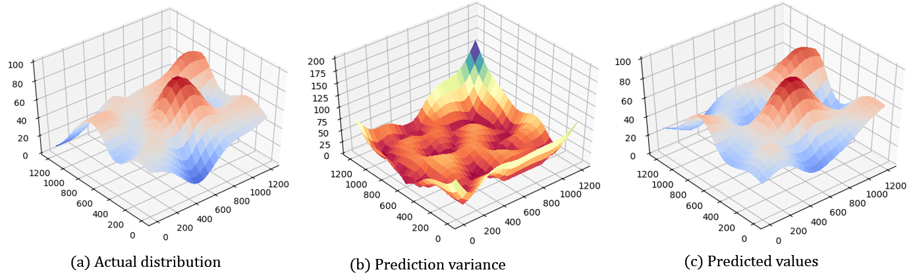

# Optimal Flight Plan for Drones

Motivation

Drones equipped with remote sensing systems are rapidly becoming a valuable tool for emergency response units as they
can quickly provide reliable information after an incident. However, controlling these vehicles and interpreting the
obtained measurements also imposes further demands on the response squad in an already stressful situation. Therefore,
integrated and automatic mission planning tools are needed that plan drone routes such that the maximum amount of
information is provided within as short a delay as possible.

## Vision: Interactive UAV Deployment

Our vision for an interactive tool supporting automated UAV deployment is depicted in Figure 1. In this scenario, we
consider a drone equipped with a hyperspectral camera that is used to identify hazardous substances. This drone is
started immediately after the response unit arrives on scene. First, it takes an initial survey image at high altitude,
providing a first overview of the target region. This serves as an initial data source for planning the remainder of the
flight. It also represents the first data source for identifying and prediction gas clouds. The drone then proceeds with
its tour, making more measurements as it travels across the target area. During this time, the planned route is modified
in an iterative process: The newly obtained images are prepared and preprocessed in order to be transmitted to the base
station. They are used as updates for the gas cloud prediction and are communicated to the user. The drone mission can
furthermore be adapted based on these measurements, e.g. moving to areas where hazardous gases are most likely to be
present. Furthermore, the user can define additional POIs such as public building

!!! info "Figure 1: Interactive drone deployment"
    

## Informative Path Planning

The planning problem consists of determining a path $P$, i.e. an ordered sequence of target locations for the drone. The
cost of this path $cost(P)$, e.g. in terms of required flight time, needs to be less or equal to the maximum budget
$C_{max}$ available. Specifically, the drone needs to return before its energy supply is depleted. The objective is to
find a path $P$ that maximises some measure of informativeness $I(P)$. Hence, the fundamental planning problem is to
balance resource consumption and information gain during the trip. This problem can be formulated as follows:

$$\max I(P) \\
s.t. cost(P) <= C_{max}$$

Several objective functions $I(P)$ exist to describe this informativeness.
Two of the most frequently used ones in literature are
- Maximising the achieved reduction of the prediction error variance,
- Maximising the mutual information between observed and unobserved locations.

The prediction error variance increases the further away an unobserved location is from a selected sensing location.
Similarly, the mutual information typically decreases the farther locations are from one another. Hence, both measures
favour sensing locations that are well distributed across the region of interest. However, both of these approaches
require a reliable model of the observed phenomenon in form of a Gaussian Process in order to determine error variances
and mutual information. In practice, it is unlikely that an accurate process model is available before the start of the
drone flight. We therefore use an approximate model of spatial correlations. While this approximation is not an accurate
description of the observed phenomenon, it can be computed more efficiently, which is highly relevant for a
time-constraint application such as the use case considered here. Similar to the two measures discussed above, it
considers paths as “informative” that consist of sensing locations distributed as evenly as possible within the target
region.

## Heuristic Solution Approach

Rather than solving an exact model, we use a heuristic solution approach for determining drone routes. An initial path
is determined using a simple construction strategy. Then, this path is iteratively improved by destroying and rebuilding
parts of a solution using an Adaptive Large Neighbourhood Search approach. These approaches have been shown to quickly
determine high-quality solutions even for large vehicle routing problems with several hundred candidate sensing
locations.

## Evaluation and Results

We evaluate the proposed model and solution approach in an extensive simulative study on artificial spatially correlated
random fields. This way, we can consider scenarios larger than any that would be possible in preliminary test flights,
and validate the robustness and effectiveness of our approach on a wide range of possible situations.

Figure 2 gives one example of such a scenario: We consider a target region of 1200 x 1200 m, and a drone with a maximum
flight time of 900 seconds at a maximum speed of 10 m/s. The left image represents the actual distribution of values
within the target region, i.e. the simulated smoke cloud. Below, we present the results of the solution approach. The
middle image indicates the remaining prediction error variance. Here we can recognize selected sensing locations for the
drone flight dark red. At these locations, the drone obtains accurate information about the random field, which means
that error variance is minimal. For the remainder of the target region, error variance increases with increasing
distance to the next sensing locations, since there is less information is available about these locations. The
resulting prediction is indicated on the right hand side. Obviously, the information gained about the underlying process
is rather accurate, as the prediction closely follows the actual distribution. Hence, even though the maximum flight
time would be insufficient to survey each location within the target area, it still allows to accurately detect the
smoke cloud and to provide detailed information about the spatial distribution of hazardous gases.

!!! info "Figure 2: Autocorrelated field, predicted values and prediction quality."
    
