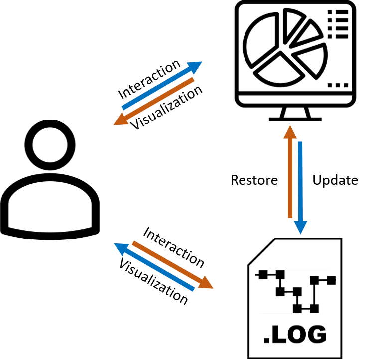

!!! note "Responsible person for this section"
    Manuel Stein

# EnviroCar (Smart City)

The human desire for mobility is an observable global trend. To visit a place of choice fast, cheaply and safely nowadays has become a basic need to mankind. This increasing demand for mobility is reflected by the worldwide CO2 emissions where motorized individual transport is contributing an essential portion to the global CO2 emissions such that it was the second largest sector in 2014. The health effects caused by the world's increasing traffic are, additionally, not only restricted to the emitted pollutants and emission gases but also to factors such as noise pollution. In a recent study, for example, about 40 \% of the population in EU countries is exposed to road traffic noise at levels exceeding 55 db(A). 

## Motivation

In this work, we by propose a holistic view to the analysis of mobility data by helping experts to develop and realize sustainable mobility concepts. We consider visual analysis as the natural way to interact with this kind of mobility data supporting analysts to create, refine and verify hypotheses. Using data from the citizen-science platform enviroCar, we contribute a Visual Analytics system allowing analysts to leverage their background knowledge in the analysis process.

## Short section about available data

The used dataset contains approximately around 1.7 million data points. Each data record contains 24 attributes reflecting sensor values of the vehicle (e.g. speed, rpm, ...) as well as a CO2 estimation. Each data point is part of a trip, which is described by a trajectory. While there are 5734 trips, a set of the trips' trajectories can furthermore be associated with a sensor. There are 160 registered sensors which may be directly associated with a vehicle. Additional information about the vehicle (type, etc.) is provided as well.

Picture 1: Distribution of trips per sensor (german).

Picture 2: Distribution of trips per month in 2016 and 2017 (german).

## Visual Analysis of Traffic Data

Picture 3: Visualization using a clock metaphor, displaying the temporal development of the average CO2 emissions.

Picture 4: Exact course of all trip trajectories in the german city of Mönchengladbach between 0 am and 6 am (left). Magnification of the selected region highlighted by the red rectangle (right).

Picture 5: (a) Dot Map of a frequently traveled intersection. (b) Dense pixel display visualization of the same intersection. The data points are colored and sorted based after their CO2 emissions. (c) Data points sorted based on their speed. (d) Data points sorted based on their engine speed.

## Visual Interactive Logging and Provenance

Performing interactions in various visualizations and chaining together various filtering, aggregation and navigation steps can quickly become overwhelming and can lead to the analyst losing the overview of the analysis process. This can lead to frustration with the system and also a loss of trust in the findings. Another important aspect is the issue of reproducibility of results arising from the inherent complexity of the system. To cope with both of these problems, we need to enable the analyst to maintain an overview of the previous analysis process. 

Picture 6: Systematic approach for the realization of interactive visual logging.

## Paper

More info about this project can be found in our paper "Visual Analysis of Urban Traffic Data based on High-Resolution and High-Dimensional Environmental Sensor Data" (currently under submission) 

    
## Related Scenarios
- [Smart City](../scenarios/01_city.md)
- [Environment](../scenarios/03_env.md)
