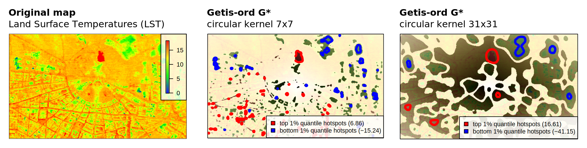

# Hotspot analysis (using G*)

[Responsible person]: "Viliam Simko"

## Problem definition

- We have a map, in this case a map of land surface temperatures
- We want to find hotspots, i.e., areas on map that are **significantly different from their surrounding area**.
- We want to use Getis-Ord G* statistic as the tool for finding the hotspots
    - see section [Standards Getis-ord](../../methods/getis-ord.md)
- We want to parallelize the computation in our Spark cluster.
    - see section [Rasterized Getis-ord](../../methods/getis-ord-raster.md)

[](getis-ord-example.svg)

## Hotspot analysis using geotrellis

In this section we show a simplified version of the hotspot analysis.
We use the [Geotrellis](https://github.com/locationtech/geotrellis) library to achieve the parallelization.
Some assumptions are:

- we use 2-dimenational data (only the spatial part without the time component)
- we store our data as a layer of tiles in geotrellis catalog (distributed raster)
- our hotspot analysis uses the standard G* with variable window

First, we need to express the G* formula in terms of the map algebra operations.

## Scala code

Full source code can be found in our github repository: 
[biggis-project/biggis-landuse](https://github.com/biggis-project/biggis-landuse/blob/master/src/main/scala/biggis/landuse/spark/examples/SpatialGetisOrd.scala)

```scala
// typical type definition used by geotrellis
type SpatialRDD = RDD[(SpatialKey, Tile)]
                  with Metadata[TileLayerMetadata[SpatialKey]]
  
def getisord(rdd: SpatialRDD, weightMatrix: Kernel,
             globMean:Double, globStdev:Double, numPixels:Long): SpatialRDD = {

  val wcells: Array[Double] = weightMatrix.tile.toArrayDouble
  val sumW: Double = wcells.sum
  val sumW2: Double = wcells.map(x => x * x).sum
  
  // variables used in the getis-ord formula
  val A: Double = globalMean * sumW
  val B: Double = globalStdev * Math.sqrt((numPixels * sumW2 - sumW * sumW) / (numPixels - 1))

  rdd.withContext {
    _.bufferTiles(weightMatrix.extent)
      .mapValues { tileWithCtx =>
        tileWithCtx.tile
          .focalSum(weightMatrix, Some(tileWithCtx.targetArea)) // focal op.
          .mapDouble { x => (x - A) / B } // local op.
      }
  }
}
```

Let's assume, we already have the following variables:

- `layerReader`: helper class to query tiles from geotrellis catalog/layer,
- `layerId`: ID of the raster layer used as input raster,
- `kernelRadius`: size of the weight matrix (how many pixels)

```scala
// RDD (distributed dataset from Apache Spark) representing all tiles in the layer 
val queryResult: SpatialRDD =
  layerReader.read[SpatialKey, Tile, TileLayerMetadata[SpatialKey]](layerId)

// here, we use a circular kernel as a weight matrix
val weightMatrix = Kernel.circle(kernelRadius,
                                 queryResult.metadata.cellwidth,
                                 kernelRadius)

// use precomputed histogram metadata (stored in zoom level 0 inside the layer)
val stats = queryResult.histogram.statistics
require(stats.nonEmpty)

val Statistics(_, globMean, _, _, globStdev, _, _) = stats.get
val numPixels = queryResult.histogram.totalCount

// apply the parallelized getis ord
val outRdd = getisord(queryResult, weightMatrix, globMean, globStdev, numPixels)
```

The result `outRdd` is an RDD (distributed dataset from Apache Spark) that can be further processed
or stored as a new layer in geotrellis catalog.
