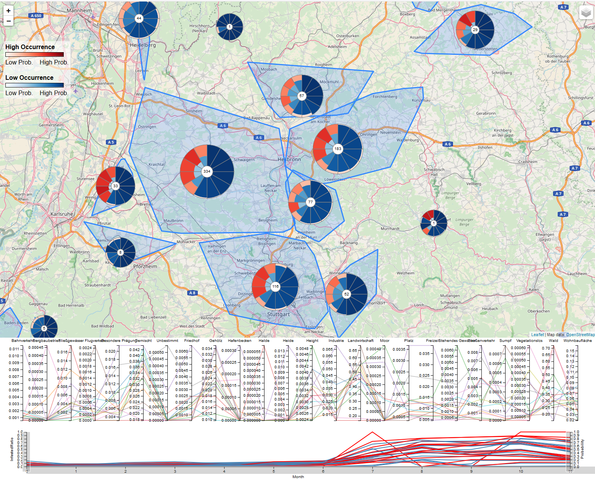

!!! note "Responsible person for this section"
    - Hannes Müller (LUBW)
    - Johannes Kutterer (Disy)
    - Daniel Seebacher (Uni Konstanz)

# Invasive species

## Motiviation

Invasive species are a major cause of ecological damage and commercial losses. A current problem spreading in North America and Europe is the vinegar fly Drosophila suzukii. Unlike other Drosophila, it infests non-rotting and healthy fruits and is therefore of concern to fruit growers, such as vintners.  Consequently, large amounts of data about the occurrence of D. suzukii have been collected in recent years. However, there is a lack of interactive methods to investigate this data.

## Used Data Sources

- ATKIS/ALKIS
- Vitimeteo
- ASTER Elevation Map

## Data Description

**Figure 1:** Data provided by VitiMeteo: Distribution of vineyards and traps in Baden-Wuerttemberg
    
    
In the data provided by VitiMeteo are, among other things, observations of the spread of D. suzukii. This data consists of trap findings of D. suzukii as well as percentage information about how many berries were infested in a sample taken at the station. Additionally, there is percentage information about how many eggs were found in a sample. This percentage can be over 100 %, if there are more egg findings than berries in a sample. These observations are collected from 867 stations non-uniformly spread over Baden-Wuerttemberg. Some of them only report observations for one day, others report multiple observations over a time period of up to 1641 days. The observations are rather sparse and irregularly sampled, which makes the use of standard time series analysis techniques challenging, if not impossible. Consequently, an interactive visual analysis should enable researchers to interactively analyze this complex data source.

## Prediction of Infested Areas

We enriched the data provided by VitiMeteo, by adding information about the environmental surroundings of each station. First, we added the height information, which we extracted from ASTER. Second, we added the surrounding land usage information. Since a local spread is possible by D. suzukii itself, we extracted the land usage information in a 5~km radius around each station. Finally, we have an 85 dimensional feature vector for each instance, consisting of the month of the year, the station height, and the surrounding land usage.

We end up with a rather imbalanced data set with four times as many negative examples as positive ones. This can cause problems since many machine learning algorithms depend on the assumption that the given data set is balanced. Although machine learning techniques exist which can deal with imbalanced data sets, such as the Robust Decision Trees, we want to employ ensemble-based classification, which is a combination of different classifiers. This allows us to improve the classification performance and also to model the uncertainty of our classification, which aids people in making more informed decisions. This requires the creation of a balanced data set, which we can achieve by either using undersampling of the majority class or oversampling of the minority class. Undersampling can be achieved by stratified sampling using the occurrence class as strata. However, this would remove instances from our already small data set. To avoid this, we employ oversampling of the minority class using the Synthetic Minority Over-sampling Technique (SMOTE). SMOTE picks pairs of nearest neighbors in the minority class and creates artificial instances by randomly placing a point on the line between the nearest neighbors until the data is balanced. Thus, allowing us to employ default machine learning algorithms.

## Hypothesenentwicklung
Hypothesenentwicklung zur Vermehrung der KEF aufgrund biologischer Erkenntnisse
(v.a. abhängig von Umgebungstemperatur und Vegetation)

## Development of the Vector Data Pipeline in BigGIS
If you are working with geo data you are faced with two different kinds of data types: vector and raster data. Both have different requirements for collection, processing and storing of the data. The data provided by VitiMeteo [www.vitimeteo.de](http://www.vitimeteo.de) are vector data. On the webpage you can find information about egg findings of D. suzukii in berries, flies catch in traps and observations of the species.  For each dataset you have a geographical position, e.g., a point.

The vector data pipeline performs the following steps:

1.	Collect the data from the source
2.	Process the data
3.	Visualize the data

*Schematic visualisation of the Vector Data Pipeline for the D. suzukii data from [www.vitimeteo.de](http://www.vitimeteo.de)*

### 1. Collection of  KEF data from www.vitimeteo.de
For the demo the gathering is split in two separate steps. First the data is downloaded from the website and is saved locally. All further steps are run on this data local data to avoid too much traffic on the vitimeteo web site. The client for downloading the data is based on [Spring Batch](https://projects.spring.io/spring-batch/) and [Spring Boot](https://projects.spring.io/spring-boot/). Downloaded data is saved in GeoJSON-files. You can find this client here: https://github.com/DisyInformationssysteme/biggis-download-kef-data

This GeoJSON file is handed over to a Kafka producer which is the first step of the stream processing prototype. The code can be found on https://github.com/DisyInformationssysteme/biggis-import-kef-data-to-kafka

### 2. Processing of the KEF data
This code in implemented using Apache Flink. The implemented jobs feature the import of GeoJSON coded sensor locations and corresponding time series. Sources are Kafka queues. Destination is a PostGIS/Postgres database. (see https://github.com/DisyInformationssysteme/biggis-streaming-vector-data)

### 3. Visualization

Just providing users with the raw results of our prediction is not sufficient as we generate over 20.000 predictions for all months and vineyards in Baden-Wuerttemberg. Furthermore, the raw results do not provide spatial context. Thus, it is not interpretable which makes it hard for experts to integrate their domain knowledge into the analysis process. Hence, we need visualization to help experts to identify spatial and temporal patterns easily. To achieve this, we follow the visual information seeking mantra of Ben Shneiderman: "Overview first, zoom and filter, details on demand"

**Figure 2:** Glyph-visualization of temporal-spatial event predictions as proposed by Seebacher et al.
    

We build a geographic information system, using a map as the basis for interaction and spatio-temporal analysis. We consider the familiarity of domain experts with this kind of visualization as an additional benefit. We visualize our predictions on the corresponding position on the map so that users are immediately aware of the geographic context. Additionally, combining our geographic visualization with a visualization of the temporal predictions into a single visualization is more effective, since this requires less cognitive effort for the users. Existing related systems such as BirdVis offer heat map overview visualizations. However, as we want to investigate the distribution of a species over time, we designed a map overlay consisting of several glyphs. This partially preserves the geographic context while glyph can be used to encode additional contextual information. The goal of our glyph is to visualize whether a certain region is endangered or not. Consequently, we visually encode the classification results of a specific month represented by its time segment. The basic design of a time segment is depicted in Figure 2. Therefore, we make use of the interior of the respective time segment to represent the classification results of the ensemble-classifiers. For each month we have a distribution of safe and endangered vineyards, according to the classification. Since the number of vineyards stays the same over all months for each glyph, we fill the area of the time segments according to the ratio of the binary outcome (endangered, not endangered). This technique results in a radial glyph similar to a stacked bar chart showing fractions of the whole. We use the colors red (endangered) and blue (not endangered), as derived from the warm-cold color scale to distinguish the outcome. We provide additional functionality, such as semantic zoom, dynamic aggregation and various details-on-demand data visualizations. 

**Figure 3:** Overview of the Drosophigator application which enables experts to perform a visual analysis of spatio-temporal event predictions.
    

## Use Cases

We want to highlight how visualization can help domain experts to gain insights about the spread dynamics of D. suzukii. We show the usefulness of our system by demonstrating how domain experts can investigate hypotheses using Drosophigator. Therefore, we investigated two recently proposed assumptions about the time of infestation by the JKI and the influences of environmental factors by Pelton et al.

**Figure 4:** Overview glyph-visualization of all vineyards in Baden-Wuerttemberg. The development over the time-segments shows that the severity of infestation and the certainty of our prediction increases in late summer and stays high until the end of the year. This corroborates the hypothesis of the JKI.
    

**Figure 5:** Comparison of the vineyards contained in two neighboring cells. The upper cell (purple) exhibits an earlier infestation by D. suzukii that the lower cell (brown). The parallel coordinates plot shows, that the vineyards in the upper cell have around 10% more surrounding woodland (*Wald*) than those in the lower cell. This finding strongly supports the hypothesis of Pelton et al.
    

## Evaluation

We presented our system at the 6th workshop of the working group "D. Suzukii" on the 5th and 6th of December in Bad Kreuznach, Germany. The goal of this workshop is the mutual exchange of knowledge between researchers and practitioners. Over 80 biologists, researchers, agri- and horticulturists from various countries participated in the workshop. The focus of our talk was our application *Drosophigator*, especially the design and interpretation of the glyph as well as the interaction possibilities with the system.  After the presentation of the system, a questionnaire was handed out to the workshop participants where they could rate the different aspects of our application and could provide us with additional information about their background. We use the results of this questionnaire to evaluate our system and design decisions. 

**Figure 7:** Evaluation of system feedback of all participants (n=37). Shown are the responses of the participants on questions regarding the visualization design (*V1, V2, V3*), the interaction design (*I1, I2*) and the analysis capabilities (*A1, A2, A3, A4*) of our system Drosophigator.
    

The results of our evaluation make it clear that there is a strong need for intuitive and interactive systems, which support the experts in their daily analysis tasks. The experts are, for the most part, very positive about *Drosphigator*. Our glyph design was comprehensible, helped them to understand the temporal occurrence of D. suzukii and integrating it in a map helped them to interpret the results. Additionally, allowing for a seamless clustering of vineyards into larger regions is deemed important, as it allows the analysis of micro- and macroecological factors. However, experts are still divided in their opinion, whether the application can support them in their work. This is reflected in their opinion about the possibility to infer causes for the occurrence of D. suzukii from our application.

## Related Scenarios
- [Environment](../scenarios/03_env.md)
