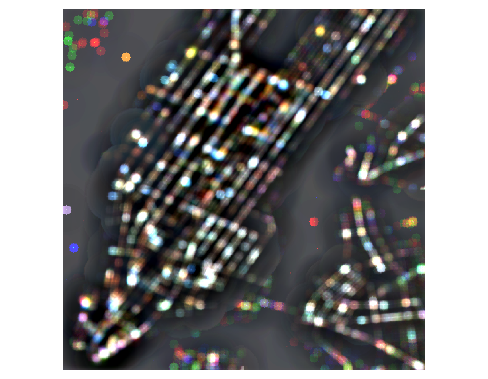

# Stability of hotspots

!!! note "Responsible person for this section"

    Marc Gassenschmidt

    - comparison of different metrics (soh, jaccard, ...)
    - comparison of different methods (gstar, focalgstar, ...)

## Setup

In `parameters.Setting` the folders have to be specified first.

`inputDirectoryCSV`:
Folder for the CSV data. If data does not exist change to local folders.
To download the data in demo. Execute the main program up to the line 16. 
This will automatically download the New York Taxi Trip Data for January/February/March 2011-2016.

!!! warning
    This dataset is approx. 30 GB

Results are stored in directories `ouptDirectory` and `statDirectory`.

## Calculation of hotspots for geo data

Execute `demo.Main'` for the calculation of hotspots and variation of the focal matrix/weight matrix and aggregation
level.

Scenario(variation of parameters between parent and child): Focal/Weight/Aggregationsstufe

Results can be found at "outputDirectory"/"Scenaria"/focal_/"(true|false)"d3.csv
For example: "outputDirectory"/Aggregation/focal_falsed3.csv

```csv
F,W,Z,Down,Up
0,1,2,0.0,0.06053811659192825
0,1,3,0.0,0.10396039603960396
```

As well as the TIFs in folder `2016`.
Can then be displayed in the following way using QGis:

!!! info "Focal G* example - single band"
    

## Calculation of hotspots for geotemporal data

`scripts. MetricValidation` can be executed to perform the calculation for the geo-temporal space. Here the metrics
`getisOrd. SoH#getMetrikResults` will be called. An `Array` with different test settings can be createdUnder
`scripts.MetricValidation#getScenarioSettings`.

The following will be computed:

  - G* for 2016
  - Various Metrics
  - G* for 2011-2015 including the percentage match

  - Focal G* for 2016
  - Various Metrics
  - Focal G* für 2011-2015 including the percentage match

The path of the metrics results is defined in the method `importExport.PathFormatter#getResultDirectoryAndName`.

For example `{ouptDirectory}/GIS_Daten/2016/1/Metrik/focal/a4_w5_wT1_f20_fT2result.txt`

Metric     | Value
-----------|-------
SoH_Down   | 0.7549668874172185
SoH_Up     | 0.04694835680751175
neighbours | (1,0,1,0,1,0)
jaccard    | 0.5352112676056338
percentual | -1.0
time_Down  | 0.45329470205147443
time_Up    | 0.13020833333333334
KL         | 0.9963685899429499
...        | ...

The paths to the TIFs are defined within the method `importExport.PathFormatter#getDirectoryAndName`.

!!! info "Focal G* example  (multi-band)"
    `{ouptDirectory}/GIS_Daten/Mulitbandtrue/2016/3/GStar/focal/a3_w6_wT2_f16_fT3_z1`
    
