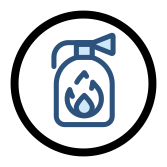

!!! note "Responsible person for this section"
    - Alexander Groeschel
    - Bodo Bernsdorf

# Disaster Management

## General

Disasters and accidents always happen somewhere. Therefore, it is necessary to use geodata even in the case of small
accident scenarios in order to assess access routes and their impact on the environment. Information support for the
safety authorities is necessary in many cases.

### Some examples

Complex traffic accidents require indications of conceivable access routes for the rescue services and, in particular,
indications of departure routes for the rescue service in order to be able to supply patients quickly.

Local storms lead to blocked or flooded roads and destroyed infrastructure, which is why rescue forces must be informed
about the main areas of operation, access routes and safe areas for the potential accommodation of evacuees.

Large fires - for example in a recycling plant - produce highly contaminated flue gases which, depending on the weather
conditions, remain on site (e. g. inversion weather conditions) or drift and diffuse. In addition to the question of the
appropriate approaching route for emergency forces, it becomes necessary to warn the population in a short time. For
that, weather and meteorological data are of interest.

Large scale disasters also require a lot of spatial data at an early stage in order to be able to identify the already
or potentially affected areas and assess the development of the situation.

## Challenges

In many accidents, immediate action is required with very little time planning. The example scenario of a dangerous
goods accident illustrates this, but can be easily transferred, for example, to attacks or incidents in production
plants with leaking harmful substances. In order to plan the measures at short notice, considerable amounts of data have
to be processed in the shortest possible time and "converted" into targeted information for the heads of operations. The
basis for this is the investigation carried out by the fire brigades' management cycle, which in such cases are always
headed by the fire brigades. In this case, important data must be collected and interpreted for all further steps.
Without accurate information, only incomplete assessments of the situation and thus decisions on measures based on
incomplete assumptions are possible.

Depending on the dynamics of the situation, the operations manager must quickly assess the dangers for humans, animals,
the environment and material assets and decide how to proceed. For example, liquid and gaseous pollutants spread very
quickly depending on weather conditions and geographical characteristics of the location. Often the outside temperature
determines the formation of flammable atmospheres and reaction products, which drift into the environment in the form of
noxious gas clouds - very difficult to predict in the event of changes in wind direction. In addition, some substances
are invisible to the human eye and/or odourless or cannot be detected or determined due to the hazard and shut-off
limits in accordance with the fire brigade regulations.

## Data Sources

As a basis for assessing the situation, considerable amounts of geodata are needed, the processing and provision of
which is the core of the subject area. The basis for this is the OGC1-compliant geodata portals of the federal states
and municipalities, which provide information on topography, the water network, the environment, population, sewers and
direct dischargers, for example. Until recently, however, this data was only updated in multi-annual cycles, which made
it necessary to supplement current data sources. Since June 2015, the Sentinel 2 mission, as part of ESA's COPERNICUS
system, has been delivering high spatial resolution satellite data in the visible and radar range with 14-day update
cycles.

In addition to the geodata, an on-site investigation is necessary to determine the necessary measures. This can be
complicated by various factors. For example, substance identification can be problematic in accidents involving
dangerous goods transporters from a distance, as the prescribed vehicle signage is not always up-to-date and loading
documents are located in the inaccessible driver's cab. This makes the acquisition of the latest data at the place of
use indispensable. This includes measurement data obtained via portable sensors (catalytic multi-warning and Ex devices,
chemo-sensors or test tubes). In larger locations, terrestrial measuring vehicles (so-called NBC scanners) or the
Analytical Task Force (ATF) are used. Such vehicles have photoionization detectors (PID) or optical sensors such as the
SIGIS2 system. However, these measurements are often complex and associated with dangers, for example in the case of a
potentially 30,000 litre petrol-contaminated vehicle.

## New Solution Concepts within the BigGIS Project

BigGIS is intended to enable an improved operational environment evaluation by the head of operations by combining the
currently acquired mass data with equally extensive and complex archive data. To this end, a new approach of
exploration, analysis, integration and visualisation must be developed for the described application scenarios. The goal
is a much faster and more reliable solution for providing approach routes to the site, the location of supply areas for
emergency personnel moving up, as well as the situation evaluation at the site of operation, including the detection of
possible pollutants and the prediction of their temporal and spatial dispersion and the derivation of suitable measures.

In addition to the previously available geo and meteorological data, the BigGIS project will use optical, airborne data
to record traffic infrastructure, existing buildings, protected goods and, if necessary, the identification of
endangered persons. This data can be captured by a [flying robot equipped with multi-spectral or hyperspectral
sensors](../../demos/optical-remote-sensing/index.md) (similar to SIGIS2) and flying autonomously over the scene of the
accident. These so-called UAS (Unmanned Aerial Systems) continuously send data over a broad spectrum (visible light up
to infrared or far infrared) of the underlying air layers to BigGIS. Hyperspectral sensors often generate data volumes
in the gigabyte range for each photo flight and application. BigGIS should be able to handle these data volumes and
offer suitable APIs to perform data analysis and integration at scale.

Further images taken with the aid of the flying robots indicate the direction and velocity of propagation of pollutants
(liquid, gaseous). This allows for forecasts of the diffusion and drift of the pollutants more accurately than with the
usual approaches (Halpaap's club, MET or Memplex club etc.). In principle, it is possible to classify escaping
substances or reaction products in pollutant pools or noxious gas clouds by means of absorption spectra in the infrared
and far infrared range. Sensors such as Hygas, SIGIS 2 and CHARM are already available as ground stated or aviated
systems for that purpose. In the BigGIS project, [initial feasibility
studies](../../demos/optical-remote-sensing/index.md) were carried out to test the substance identification of simulated
noxious gas clouds with multi-spectral cameras for the visible range, which are suitable for use with small drones due
to their relatively low weight.

In order to make efficient use of such drones, the BigGIS project is offers an implementation of [autonomous, optimal
flight planning](../../demos/optimize-drones.md) by the drone itself.

At the same time, models are being developed that can [predict the propagation of a detected gas
cloud](../../demos/gas-predict.md). The aim is to predict possible future scenarios for the spread of the pollutant,
wind directions and strengths (e. g. taken from FeWIS), the geo-positions of neighbouring residential areas and their
surrounding structure, for example via satellite images, geographical characteristics of the accident area, depending on
the information on the spread of the pollutant, wind direction and strength (e. g. taken from FeWIS). The predicted
scenario is to be presented to the operations manager in a compact, understandable way by means of new visual techniques
directly with the (unsure) knowledge about the spread of the pollutants and thus enable decision support.
