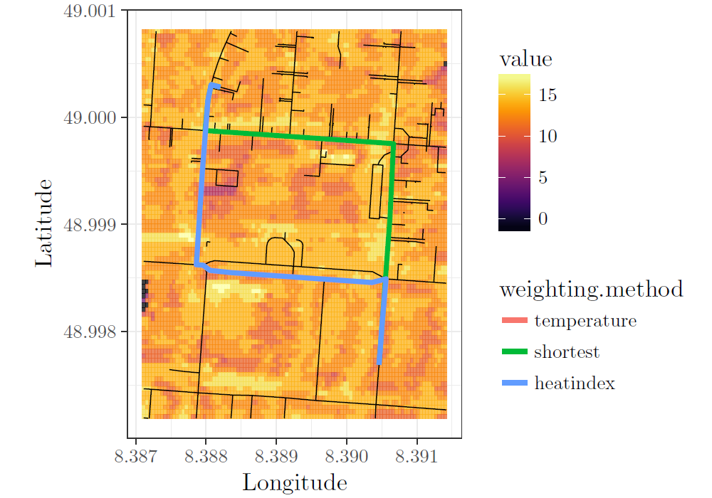
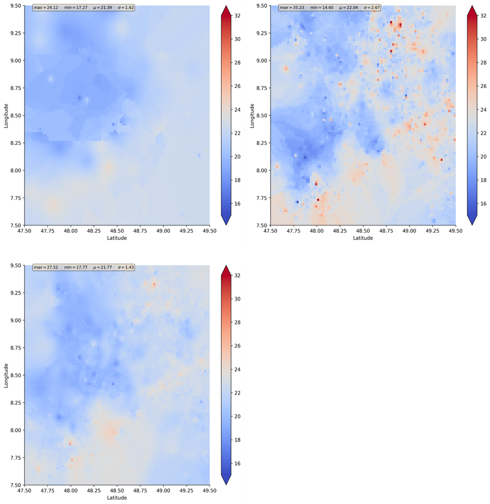

# Smart City

Today, the paradigm of Smart City is quite well-known. It is strongly connected to the rise of big data, as most big data applications are based on spatio-temporal data acquired in cities. These include such manifold of new data sources such as smartphones, humans as sensors for socio-economic changes, potential augmented applications as well as volunteered geographic information (VGI). Examples include the New York taxi data set or VGI temperature data such as from the Wunderground or OpenSenseMap platforms.

### Examples

As temperature impacts human health, well-being, work performance (heat stress), energy consumption and many more factors, a sound understanding of causal dependencies and a respective prediction models is mandatory for smart city planning and operation. Thanks to recent advances in sensor system solutions together with the smart city movement, various data sources related to temperature are increasingly available. For instance, one can exploit temperature measurements to minimize the impact of heat stress on humans regarding their daily routines and walking paths [^Rußig & Bruns, 2017].

!!! info "Example for Heat Based Routing, taken from Rußig & Bruns, 2017 [^Rußig & Bruns, 2017]."
    

Furthermore, construction work and breaks could be scheduled according to the fine grained temperature forecasts. In addition, a better understanding of causal reasons for temperature differences in a city can help shaping decision for city planners regarding city development plans. In case of load planning for electric grids, the impact of air conditioning load on a grid can be forecasted depending on the temperature distribution in a fine grained manner [^Hassid et al., 2000]. Other options include the use of groundwater for heat saving [^Benz et al., 2015]. Unfortunately, existing models do not allow for such smart city operations, or only in a limited fashion. As of today, temperature models are either too coarse-grained (modelling differences between larger regions such as between urban and rural areas) or very detailed (modelling single buildings). Therefore, we focus in the smart city scenario on the understanding of temperature by using and combining official and VGI data to further this understanding.

We provide new methods and models to identify, explain, predict and forecast temperature, its local differences and critical areas for a smart city planner. More details are found in the UHI page.

!!! info "Example for temperature prediction with different data sets and prediction methods."
    

[^Rußig & Bruns, 2017]: Rußig, J. and J. Bruns (2017). **Reducing individual heat stress through path planning.** GI_Forum 1, 327–340.

[^Hassid et al., 2000]: Hassid, S., M. Santamouris, N. Papanikolaou, A. Linardi, N. Klitsikas, C. Georgakis, and D. Assimakopoulos (2000). **The effect of the Athens heat island on air conditioning load.** Energy and Buildings 32(2), 131 –141.

[^Benz et al., 2015]: Benz, S. A., P. Bayer, K. Menberg, S. Jung, and P. Blum (2015). **Spatial resolution of anthropogenic heat fluxes into urban aquifers.** Science of TheTotal Environment 524, 427 – 439.